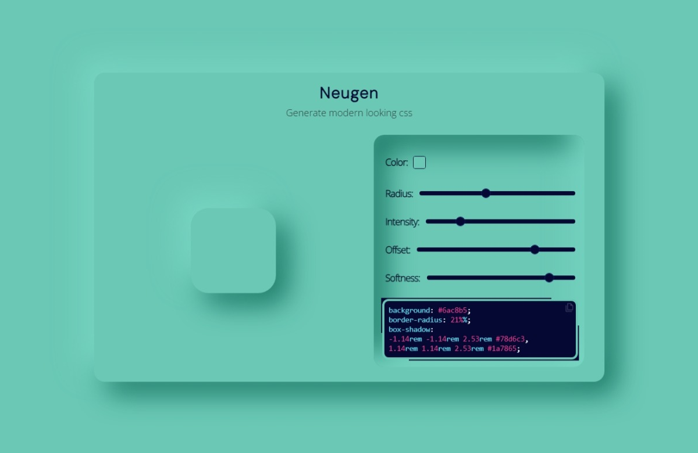

# Neugen

A lightweight CSS code generator for the popular design trend called neumorphism.
Hoping it'll help front-end dev and designers to build better UIs. Made with vanillaJS.

The goal is not to make a neumorphism.io clone, but rather purposing a more complete tool.
(like transitions and many other features in the future)

Contributions and help are welcome.

> Written with [StackEdit](https://stackedit.io/).
